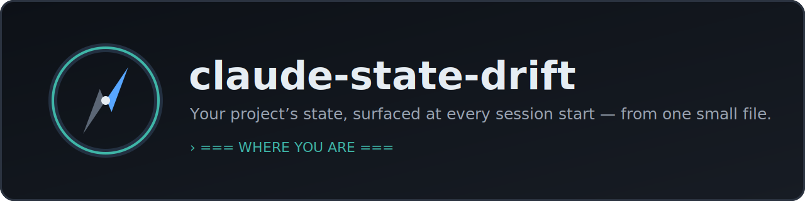
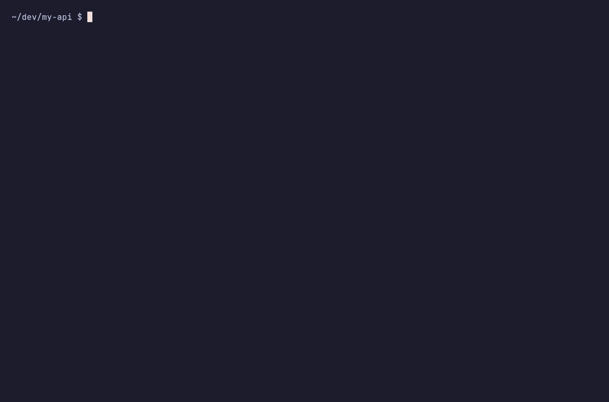
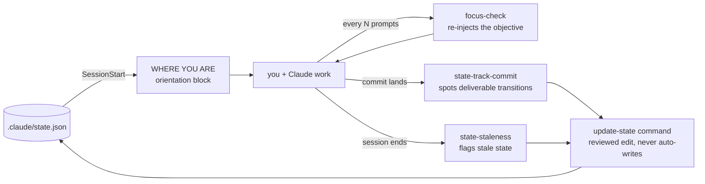
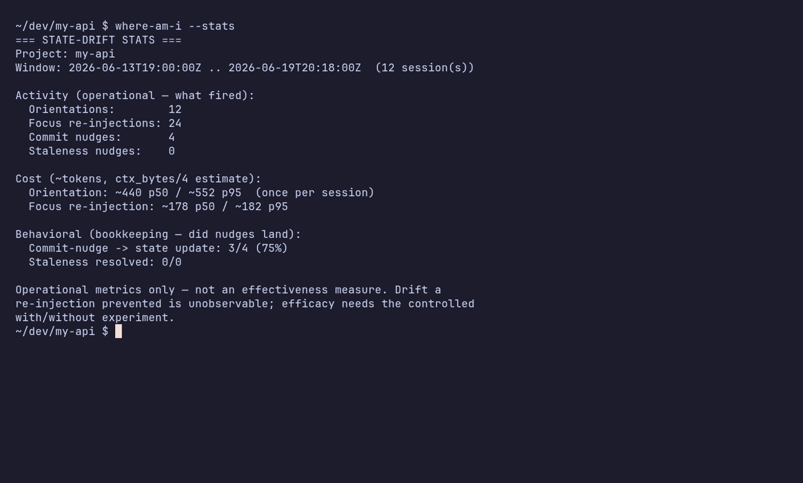
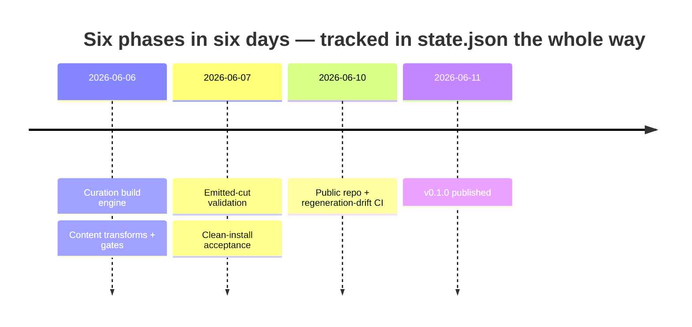
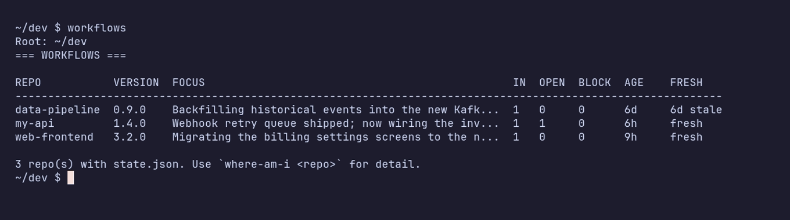

<p align="center">
  
</p>

<p align="center">
  <a href="https://github.com/goldenwo/claude-state-drift/actions/workflows/ci.yml"></a>
  <a href="https://github.com/goldenwo/claude-state-drift/releases"></a>
  <a href="LICENSE"></a>
  
  
</p>

**Pick up exactly where you left off — every session.**

One `.claude/state.json` holds your project's objective, deliverables, and open
questions — and [Claude Code](https://docs.claude.com/en/docs/claude-code), GitHub
Copilot CLI, and OpenAI Codex CLI all open the session with it, auto-shown as a
**WHERE YOU ARE** block before your first prompt.

## ✨ See it in action

<p align="center">
  
</p>

## Why

Coming back to a project — a week later or an hour later — means rebuilding context
before you can do anything useful: *what was I doing, what's already done, what's still
open?* `claude-state-drift` keeps that answer in one small `.claude/state.json` and puts
it in front of you and the agent before the first prompt — no reconstructing it from
scrollback, memory, or `git log`.

## Highlights

- **Orientation on every session start** — the "WHERE YOU ARE" block shown above,
  generated from your project's real state: objective, current focus, what's done, and
  what's still open.
- **Your objective, kept in view** — in interactive sessions the objective and current
  focus are re-surfaced every few prompts, so they don't scroll out of reach (cadence
  tunable per project).
- **Staleness nudges** — get flagged when `state.json` looks out of date relative to
  recent work, or when a commit looks like it finished a deliverable.
- **You stay in control** — `state.json` is never silently rewritten; updates are drafted
  and shown as a diff before they land. A curated north-star, not an auto-captured log.
- **Zero workflow change** — all of the above is automatic, driven by hooks. You
  never have to remember to invoke anything; the [commands](#commands) exist for
  when you *want* manual control.

## Install

### Claude Code

```
/plugin marketplace add goldenwo/claude-state-drift
/plugin install claude-state-drift
```

Then drop a starter `.claude/state.json` into your project — copy one from
[SCHEMA.md](SCHEMA.md) — and start a session. Uninstall any time with
`/plugin uninstall claude-state-drift`.

### GitHub Copilot CLI

```
copilot plugin marketplace add goldenwo/claude-state-drift
copilot plugin install claude-state-drift@claude-state-drift
```

The plugin's `sessionStart` and `postToolUse` hooks read the same
`.claude/state.json` and emit it as Copilot's `additionalContext` — one hook at
session start, one after commits. See
[copilot/README-copilot.md](copilot/README-copilot.md) for full instructions and
what each hook does.

### OpenAI Codex CLI

```
codex plugin marketplace add goldenwo/claude-state-drift
codex plugin add claude-state-drift@claude-state-drift
```

Codex CLI has a Claude-compatible lifecycle hook system, so the same
`.claude/state.json` drives all four hooks there too — orientation, commit-transition,
focus re-inject, and staleness. See
[codex/README-codex.md](codex/README-codex.md) for what each hook does and the lite
(`AGENTS.md`) tier.

## How it works

Four hooks — all automatic — and five optional commands, all reading one file:



1. **Auto-injected at session start — zero action.** A `SessionStart` hook prints the
   "WHERE YOU ARE" block from `state.json`. Install it, drop in a `state.json`, and it
   runs on every session from then on; you never invoke anything.
2. **You stay in control.** `state.json` is *never* silently rewritten. When there's an
   update to make — a finished deliverable, a shifted focus — it's drafted and shown to
   you as a diff before it lands. It's a curated north-star you approve, not an
   auto-captured log of everything you did — the honest edge over tools that scrape a
   session into state behind your back.
3. **Nudged to keep it fresh.** A `PostToolUse` hook spots commits whose subject looks
   like a finished deliverable and points you at `update-state`; a `Stop` hook flags
   `state.json` when it looks stale (and suggests `state-clean` once old `done`
   deliverables pile up — it only ever flags, never auto-edits). In interactive sessions,
   a `UserPromptSubmit` hook also re-surfaces the objective every few prompts (cadence
   tunable in `.claude/hooks-config.json`).
4. **Honest scope note.** That periodic re-surfacing rides on your prompts, so it's
   *interactive-only*: a headless run with no user turns — `claude -p`, an
   autonomously-driven SDK loop, CI — gets the one-time session-start orientation and
   nothing recurring. Everything is computed from local files and local git; nothing
   leaves your machine.

## Commands

For when you want to check or change state deliberately rather than waiting for
a hook. Plugin commands are always namespaced in the Claude Code CLI — type
`/claude-state-drift:` and tab-complete:

| Command | What it does |
|---|---|
| `/claude-state-drift:where-am-i` | Print the orientation block on demand — objective, focus, deliverable statuses, recent commits. |
| `/claude-state-drift:update-state` | Draft an update to `state.json` from recent work and show the diff. Never auto-writes — you approve every change. |
| `/claude-state-drift:re-anchor` | Audit the current session against the objective and report alignment: on-track, mild drift, or significant drift. |
| `/claude-state-drift:stats` | Show this project's own telemetry — sessions, per-injection token cost, activity, and nudge→update conversion — computed locally (needs `CLAUDE_HOOK_LOG=1`). |
| `/claude-state-drift:clean` | Keep `state.json` lean: dry-runs `state-clean`, shows which old `done` deliverables would be archived, confirms with you, then archives them (to an append-only `state-archive.jsonl`; reversible). |

Outside the CLI (e.g. the desktop app), typed plugin commands aren't supported —
just ask in plain words ("where am I?", "update the project state", "are we still
on track?") and Claude invokes the matching skill.

## With and without

No magic — just the difference between state that lives in a file and state that
lives in a scrolling context window:

| Moment | With claude-state-drift | Without |
|---|---|---|
| Session start | Orientation block from your real project state | Cold start; you re-explain or the agent re-derives |
| 40 prompts in | Objective re-injected on a cadence; still in context | Goal relies on whatever survived context compaction |
| After a milestone commit | Nudge to record the transition in `state.json` | Project state lives only in git archaeology |
| Next week's session | Picks up exactly where the file says you left off | Reconstruction from memory and scrollback |

## What it costs

A tool you add to every session only earns its keep if it isn't itself context
bloat. It isn't — and almost all of the cost is paid once, at session start:

<p align="center">
  
</p>

<p align="center"><sub><em>From a small demo project — the orientation block scales with your <code>state.json</code> size; the typical range is below.</em></sub></p>

| Injection | When | Typical size |
|---|---|---|
| Orientation block | once, at session start | ~700–2,000 tokens |
| Focus re-injection | every 6th prompt (tunable) | ~180 tokens |

For a typical long session that's roughly **1,000–4,000 tokens total — under 1–2%
of a 200K window** — and most of it is the one-time orientation block, which
prompt-caches with the rest of your session prefix. The only recurring cost, the
focus re-injection, is smaller than a single file read.

Two things keep it bounded:

- The re-injection stays small — `current_focus` is length-capped, and the objective is your one-line master vision.
- The orientation block scales with what *you* put in `state.json` — a
  one-sentence `current_focus` keeps it near the low end. You're in control.

Tune or disable the per-prompt focus check per project in `.claude/hooks-config.json`
(see [SCHEMA.md](SCHEMA.md)); the session-end staleness nudge has its own
`STATE_STALENESS_*` environment switches. Nothing is measured remotely: the optional
`CLAUDE_HOOK_LOG=1` writes a local `.claude/.hook-log.jsonl` and nothing leaves
your machine. For scale, that per-session cost is in the same range as a lean
project `CLAUDE.md`, and a small fraction of what one MCP server's tool
definitions cost you on every turn.

(Token counts measured with a GPT-family tokenizer as a proxy; Claude's own
tokenizer differs by ~±15%. Numbers are for typical projects — a verbose
`state.json` costs more, which is why the `current_focus` field is meant to stay
short.)

## Built with itself

This plugin's own release pipeline was built while running the plugin — every
session opened by its orientation block, its objective re-surfaced by its own `focus-check`.
The repo was built across a **six-phase, 69-commit milestone** (June 6–11 2026)
with every session tracked in `state.json` by the tool — and has been dogfooded
through every release since (**70+ deliverables** tracked and counting):



That's heavy real-world use — a dogfooding record, not a controlled efficacy claim.

## The `state.json` model

The whole system revolves around one file, `.claude/state.json`:

- `objective` — the master vision; rarely changes.
- `current_focus` — one sentence on what you're doing right now.
- `deliverables[]` — units of work, each with a `status` (`done` / `in_progress` /
  `deferred` / `blocked`).
- `open_questions[]` — unresolved decisions, so they resurface instead of getting lost.
- `blocked[]` — work waiting on something external.

See [SCHEMA.md](SCHEMA.md) for the full schema, a copy-paste starter file, and the
per-project `.claude/hooks-config.json` knobs.

The plugin also bundles a few CLI tools, all on the Bash tool's `PATH` in any
session while the plugin is enabled — just ask Claude to run them:

- `state-validate` — schema-check a `state.json` (exit `0` = valid).
- `where-am-i` — print the orientation block on demand (`--history <id>` shows a
  deliverable's transition log; `--stats` shows this project's own telemetry —
  cost, activity, and nudge→update conversion — computed locally from the opt-in
  hook log, when `CLAUDE_HOOK_LOG=1`).
- `state-history` — append an entry to the per-project transition log.
- `state-clean` — keep `state.json` lean: archive old `done` deliverables into an
  append-only `.claude/state-archive.jsonl` (dry-run by default; `--apply` to write;
  `--keep N`/`--older-than DAYS` tune it). Lossless — git and the archive are the
  backstop.
- `workflows` — a cross-repo board: one row per project with a `state.json`
  (walks `~/dev` by default; override with `$WORKFLOWS_ROOT`).

<p align="center">
  
</p>

## Requirements

- Claude Code with plugin support.
- `bash`, `git`, `jq`, and Python 3 (found automatically as `py`, `python3`, or
  `python` — no configuration needed).
- CI-verified on Linux and Windows (git-bash). macOS is expected to work (the hooks
  are POSIX bash) but is not currently CI-covered.

## Troubleshooting

- **No orientation block at session start?** Your project has no `.claude/state.json`
  (the plugin stays silent rather than nagging) or the file is invalid — ask Claude
  to run `state-validate` (bundled, on the Bash `PATH` while the plugin is enabled).
- **Focus-check fires too often / not often enough?** Set the cadence in
  `.claude/hooks-config.json` — see [SCHEMA.md](SCHEMA.md).
- **Does anything leave my machine?** No. All signals are computed from local files
  and local git; there is no network access, and nothing is sent anywhere.

## License

MIT — see [LICENSE](LICENSE).

## About this repo

**File issues here — they're read and acted on.** This repo is generated: every
byte is built from a pinned source commit (see `.build-provenance`) and verified
byte-for-byte by CI on every push. Fixes land in the source and ship in the next
release, which is why pull requests can't be merged directly.
