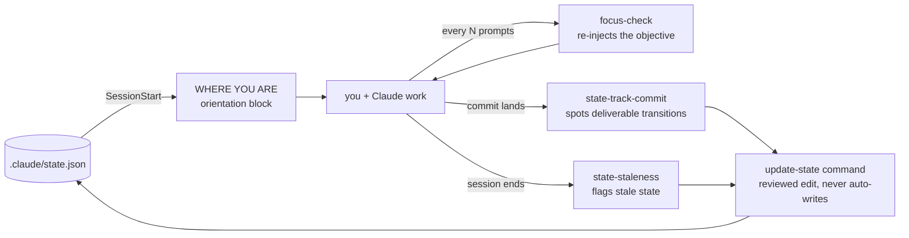
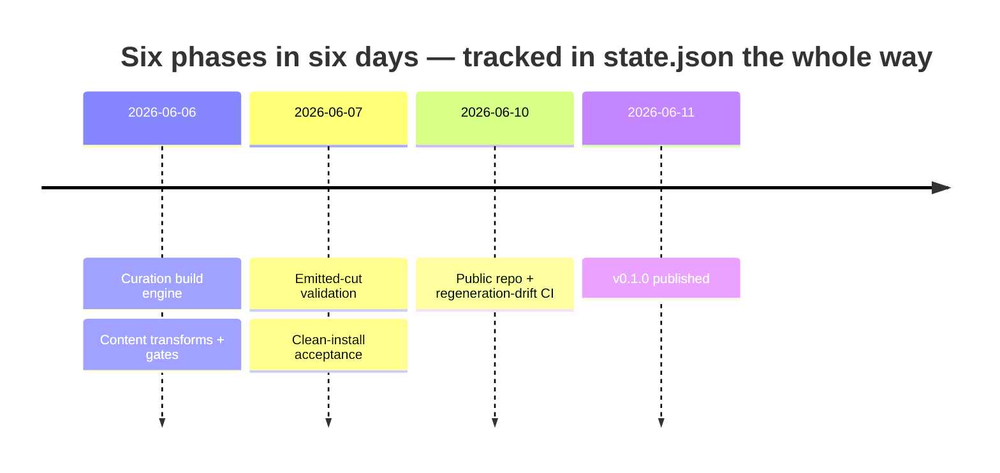

# claude-state-drift

[](https://github.com/goldenwo/claude-state-drift/actions/workflows/ci.yml)
[](https://github.com/goldenwo/claude-state-drift/releases)
[](LICENSE)

State-tracking and drift-mitigation for [Claude Code](https://docs.claude.com/en/docs/claude-code).
Every session opens with your project's actual state — not a cold start:

```
=== WHERE YOU ARE ===
Project: my-api
Version: 1.4.0 | Objective: Ship the v2 billing pipeline with usage-based invoicing
Focus:   Webhook retry queue done; now wiring the invoice-preview endpoint
In progress: invoice-preview-endpoint
Deferred:    csv-export (until billing v2 ships)
Recent: 3 commits today, last: "Add retry backoff to webhook queue"
```

Long agent sessions measurably lose the plot: models retrieve worst from the middle of
long inputs ([Liu et al., TACL 2024](https://arxiv.org/abs/2307.03172)), grow
unreliable as inputs lengthen ([Chroma, 2025](https://www.trychroma.com/research/context-rot)),
and drift from their goal as context grows ([Arike et al., 2025](https://arxiv.org/abs/2505.02709)).
`claude-state-drift` keeps a small, human-readable `.claude/state.json` per project and
continuously re-surfaces it so the goal never depends on what's still in context.

## Highlights

- **Orientation on every session start** — the "WHERE YOU ARE" block above, generated
  from your project's real state.
- **Drift checks while you work** — the objective and current focus are re-injected
  every few prompts, so the goal never fully leaves context.
- **Staleness nudges** — get flagged when `state.json` looks out of date relative to
  recent work, or when a commit looks like it finished a deliverable.
- **Zero workflow change** — all of the above is automatic, driven by hooks. You
  never have to remember to invoke anything; the [commands](#commands) exist for
  when you *want* manual control.

## Install

```
/plugin marketplace add goldenwo/claude-state-drift
/plugin install claude-state-drift
```

Then drop a starter `.claude/state.json` into your project — copy one from
[SCHEMA.md](SCHEMA.md) — and start a session. Uninstall any time with
`/plugin uninstall claude-state-drift`.

## How it works

Four hooks — all automatic — and four optional commands, all reading one file:



- A `SessionStart` hook prints the orientation block.
- A `UserPromptSubmit` hook (`focus-check`) re-injects the objective on a cadence you
  can tune per project (`.claude/hooks-config.json`).
- A `Stop` hook flags stale state (and nudges you to run `state-gc` once enough old
  `done` deliverables pile up — it only flags, never auto-edits); a `PostToolUse` hook
  notices commits whose subject suggests a deliverable transition and points you at
  the `update-state` command.
- Everything is computed from local files and local git.

None of this needs you to do anything: install, drop in a `state.json`, and the
hooks run on every session from then on. Claude also invokes the update and
re-anchor skills on its own when it detects a finished deliverable or drift.

## Commands

For when you want to check or change state deliberately rather than waiting for
a hook. Plugin commands are always namespaced in the Claude Code CLI — type
`/claude-state-drift:` and tab-complete:

| Command | What it does |
|---|---|
| `/claude-state-drift:where-am-i` | Print the orientation block on demand — objective, focus, deliverable statuses, recent commits. |
| `/claude-state-drift:update-state` | Draft an update to `state.json` from recent work and show the diff. Never auto-writes — you approve every change. |
| `/claude-state-drift:re-anchor` | Audit the current session against the objective and report alignment: on-track, mild drift, or significant drift. |
| `/claude-state-drift:stats` | Show this project's own telemetry — sessions, per-injection token cost, activity, and nudge→update conversion — computed locally (needs `CLAUDE_HOOK_LOG=1`). |

Outside the CLI (e.g. the desktop app), typed plugin commands aren't supported —
just ask in plain words ("where am I?", "update the project state", "are we still
on track?") and Claude invokes the matching skill.

## With and without

No magic — just the difference between state that lives in a file and state that
lives in a scrolling context window:

| Moment | With claude-state-drift | Without |
|---|---|---|
| Session start | Orientation block from your real project state | Cold start; you re-explain or the agent re-derives |
| 40 prompts in | Objective re-injected on a cadence; still in context | Goal relies on whatever survived context compaction |
| After a milestone commit | Nudge to record the transition in `state.json` | Project state lives only in git archaeology |
| Next week's session | Picks up exactly where the file says you left off | Reconstruction from memory and scrollback |

## What it costs

A tool that fights context rot only earns its keep if it isn't itself context
bloat. It isn't — and almost all of the cost is paid once, at session start:

| Injection | When | Typical size |
|---|---|---|
| Orientation block | once, at session start | ~700–2,000 tokens |
| Focus re-injection | every 6th prompt (tunable) | ~180 tokens |

For a typical long session that's roughly **1,000–4,000 tokens total — under 1–2%
of a 200K window** — and most of it is the one-time orientation block, which
prompt-caches with the rest of your session prefix. The only recurring cost, the
focus re-injection, is smaller than a single file read.

Two things keep it bounded:

- The focus re-injection is length-capped, so it can't grow without limit.
- The orientation block scales with what *you* put in `state.json` — a
  one-sentence `current_focus` keeps it near the low end. You're in control.

Tune the cadence or disable any of it per project in `.claude/hooks-config.json`
(see [SCHEMA.md](SCHEMA.md)). Nothing is measured remotely: the optional
`CLAUDE_HOOK_LOG=1` writes a local `.claude/.hook-log.jsonl` and nothing leaves
your machine. For scale, that per-session cost is in the same range as a lean
project `CLAUDE.md`, and a small fraction of what one MCP server's tool
definitions cost you on every turn.

(Token counts measured with a GPT-family tokenizer as a proxy; Claude's own
tokenizer differs by ~±15%. Numbers are for typical projects — a verbose
`state.json` costs more, which is why the `current_focus` field is meant to stay
short.)

## Built with itself

This plugin's own release pipeline was built while running the plugin — every
session opened by its orientation block, drift-checked by its own `focus-check`.
The receipts, as of June 2026: **50 deliverables tracked (49 shipped) and 69
commits across the six-phase milestone** that produced this repo, June 6–11 2026:



That's heavy real-world use, not a controlled study — a measured with/without
comparison is planned, and this section will carry the results when they exist.

## The `state.json` model

The whole system revolves around one file, `.claude/state.json`:

- `objective` — the master vision; rarely changes.
- `current_focus` — one sentence on what you're doing right now.
- `deliverables[]` — units of work, each with a `status` (`done` / `in_progress` /
  `deferred` / `blocked`).

See [SCHEMA.md](SCHEMA.md) for the full schema, a copy-paste starter file, and the
per-project `.claude/hooks-config.json` knobs.

The plugin also bundles a few CLI tools, all on the Bash tool's `PATH` in any
session while the plugin is enabled — just ask Claude to run them:

- `state-validate` — schema-check a `state.json` (exit `0` = valid).
- `where-am-i` — print the orientation block on demand (`--history <id>` shows a
  deliverable's transition log; `--stats` shows this project's own telemetry —
  cost, activity, and nudge→update conversion — computed locally from the opt-in
  hook log, when `CLAUDE_HOOK_LOG=1`).
- `state-history` — append an entry to the per-project transition log.
- `state-gc` — keep `state.json` lean: archive old `done` deliverables into an
  append-only `.claude/state-archive.jsonl` (dry-run by default; `--apply` to write;
  `--keep N`/`--older-than DAYS` tune it). Lossless — git and the archive are the
  backstop.
- `workflows` — a cross-repo board: one row per project with a `state.json`
  (walks `~/dev` by default; override with `$WORKFLOWS_ROOT`).

## Requirements

- Claude Code with plugin support.
- `bash`, `git`, `jq`, and Python 3 (found automatically as `py`, `python3`, or
  `python` — no configuration needed).
- CI-verified on Linux and Windows (git-bash). macOS is expected to work (the hooks
  are POSIX bash) but is not currently CI-covered.

## Troubleshooting

- **No orientation block at session start?** Your project has no `.claude/state.json`
  (the plugin stays silent rather than nagging) or the file is invalid — ask Claude
  to run `state-validate` (bundled, on the Bash `PATH` while the plugin is enabled).
- **Focus-check fires too often / not often enough?** Set the cadence in
  `.claude/hooks-config.json` — see [SCHEMA.md](SCHEMA.md).
- **Does anything leave my machine?** No. All signals are computed from local files
  and local git; there is no network access, and nothing is sent anywhere.

## License

MIT — see [LICENSE](LICENSE).

## About this repo

**File issues here — they're read and acted on.** This repo is generated: every
byte is built from a pinned source commit (see `.build-provenance`) and verified
byte-for-byte by CI on every push. Fixes land in the source and ship in the next
release, which is why pull requests can't be merged directly.
